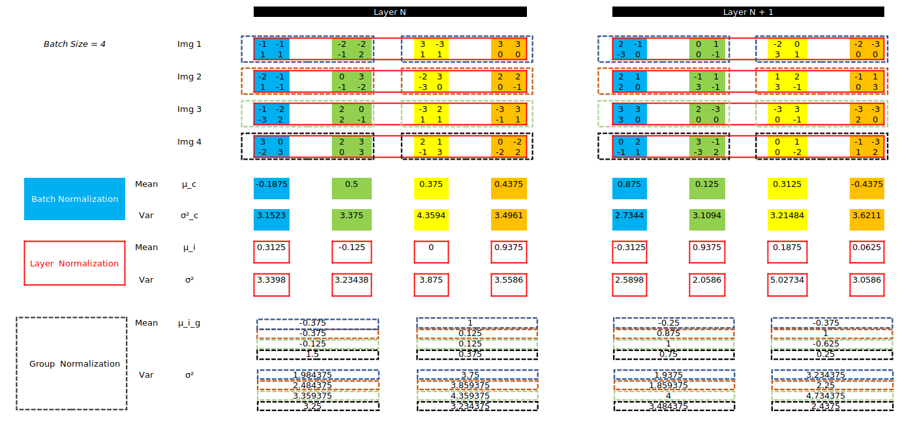
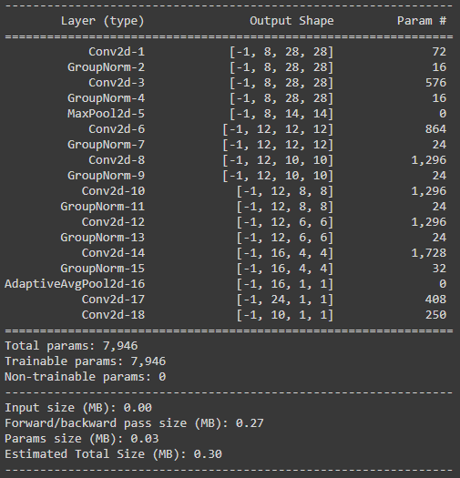
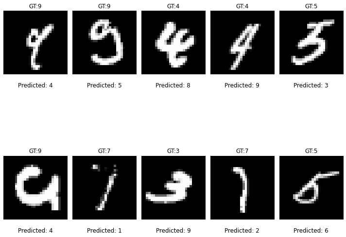
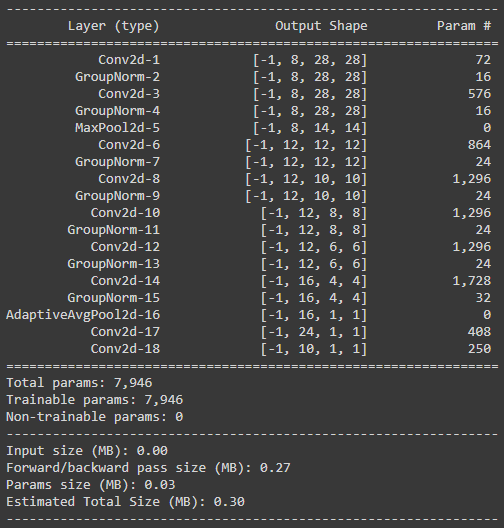
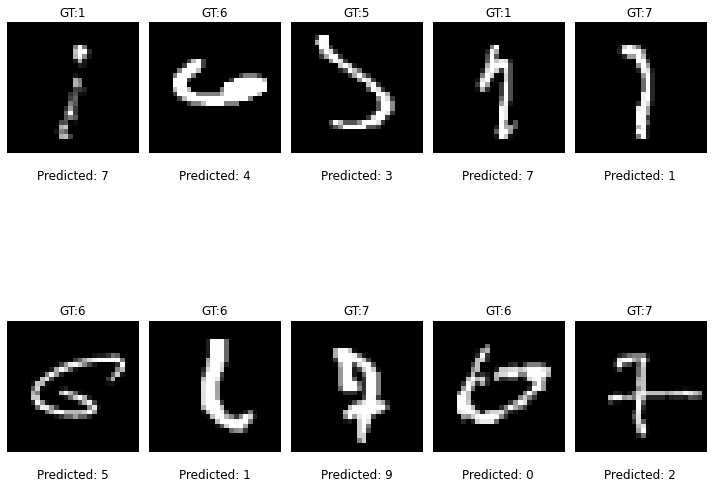
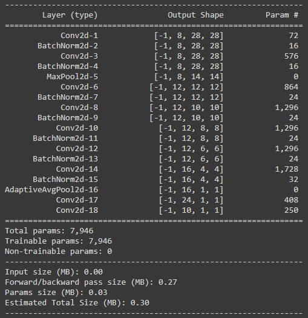
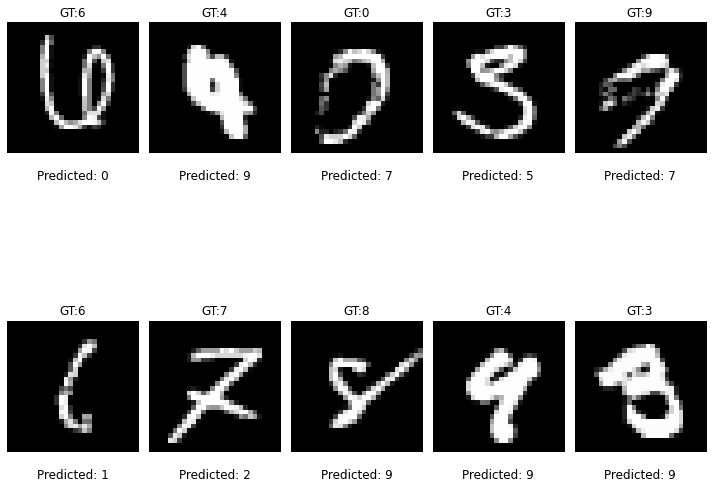
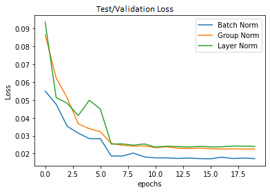
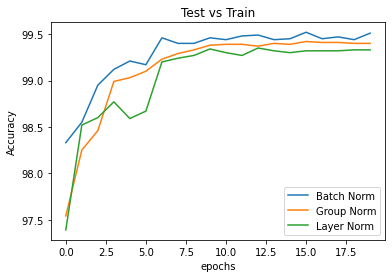

# Normalization and Deep learning architectures

## Objective
Build three architectures with:
* Network with Group Normalization
* Network with Layer Normalization
* Network with L1 + BN

## Approach

The base architecture considered is from [assignment 6](https://github.com/EVA6-Group-15/discover-architectures/blob/master/ParamsLessThan8k/MNIST_99_4_Iter06_ReducedParam.ipynb). 

The excel sheet with calculations is located [here](./notebooks/Normalizations.xlsx)

### Model 1: Network with Group Normalization
 

**Result: Misclassified images** 

 

### Model 2: Network with Layer Normalization

 

**Result: Misclassified images** 

### Model 3: Network with L1 + BN 

 

**Result: Misclassified images** 

## Plots

### Test/Validation Loss

### Test/Validation Accuracy

## Analysis

* In the validation accuracy plot, we observe that the accuracy of the model with batch norm is highest compared to the other two techniques. 
* 

