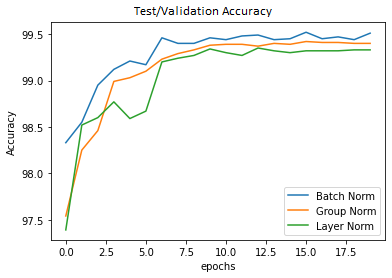

# Normalization and Deep learning architectures

## Objective

Build the following network architectures with various normalization techniques:
* Network with Group Normalization
* Network with Layer Normalization
* Network with L1 + Batch Normalization
* Network with Group Normalization + L1
* Network with Layer Normalization + L2
* Network with Batch Normalization + L1 + L2

Note: We attempted both the assignments - Good and Bad :). The notebooks are available in the following links:

## Approach

We used the base architecture from [assignment 6](https://github.com/EVA6-Group-15/discover-architectures/blob/master/ParamsLessThan8k/MNIST_99_4_Iter06_ReducedParam.ipynb). 

The model.py contains a function `norm_func` that is used to decide on which normalization technique to use. The function takes two inputs - the normalization type and the convolution layer object. Based on the selected normalization type, the channel size is obtained from the convolution layer object, and the object of the respective technique is returned. 

This is then used in the init function of the model class. Whenever a normalization layer needs to be added, the normalization technique is passed to the function and the network is generated.

In the next assignment, we will extend this modular structure and build a python package to train a model. The initial code structure is available on [DL Utils](https://github.com/EVA6-Group-15/DLUtils).

The excel sheet with calculations is [here](./notebooks/Normalizations.xlsx)

### Model 1: Network with Group Normalization
 

**Result: Misclassified images** 

 

### Model 2: Network with Layer Normalization

 

**Result: Misclassified images** 

### Model 3: Network with L1 + BN 

 

**Result: Misclassified images** 

### Model 4: Network with Batch Normalization + L1 + L2
 

**Result: Misclassified images** 

 

## Plots

### Test/Validation Loss

### Test/Validation Accuracy

## Analysis

* In the validation accuracy plot, we observe that the accuracy of the model with batch norm is highest compared to the other two techniques. The reason for this behaviour may be due to the following
  - In Group Normalization, eight groups are created with two channels in each of them. This makes the back propagation harder since the information carried by two channels are combined into one group. Each channel carries its own information and when combined the specificity of information is lost during the propagation making the training harder. 
  - Similarly, in layer normalization with only one group for all channels, the training is even harder. This can be seen in the higher values in the loss curve (and lower accuracy values) for Layer Normalization. 

 

* Layer Normalization normalizes each feature of the activations to zero mean and unit variance. It normalizes the activations along the feature direction instead of mini-batch direction. This overcomes the cons of Batch Normalization by removing the dependency on batches. 

  

* The number of parameters of the 3 architectures are the same since they all have two trainable parameters for normalization.

